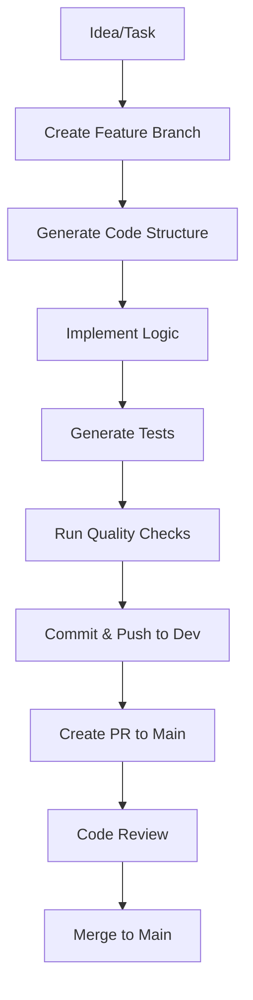
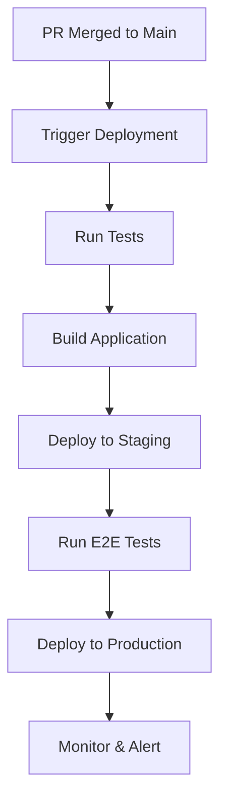

# Custom MCP Server

A comprehensive Model Context Protocol (MCP) server for streamlining development workflows and automating common tasks.

## What is MCP?

Model Context Protocol (MCP) is a standardized way for AI assistants to securely connect with external data sources and tools. It enables:

- **Secure Integration**: Connect AI models with local and remote resources
- **Tool Extensions**: Add custom capabilities to AI assistants
- **Workflow Automation**: Streamline repetitive development tasks
- **Context Enhancement**: Provide rich context from various data sources

## Features

This custom MCP server provides tools for:

### 🔧 Development Automation

- **Code Generation**: Generate boilerplate code and templates
- **File Management**: Automated file creation, modification, and organization
- **Git Workflows**: Streamlined branch management, commits, and PR creation
- **Testing**: Automated test generation and execution

### 🚀 CI/CD Integration

- **Branch Management**: Automatic dev branch creation and switching
- **Pull Request Automation**: Automated PR creation with proper templates
- **Code Review**: Automated code quality checks and suggestions
- **Deployment**: Streamlined deployment to various environments

### 📝 Documentation

- **README Generation**: Auto-generate comprehensive documentation
- **Code Comments**: Intelligent comment generation for better code understanding
- **API Documentation**: Automatic API docs from code annotations

## Installation

### Prerequisites

- Node.js 18+ or Python 3.8+
- Git configured with proper credentials
- Your preferred AI assistant (Claude, GPT-4, etc.)

### Setup

1. **Clone the repository**

   ```bash
   git clone <your-repo-url>
   cd custom-mcp-server
   ```

2. **Install dependencies**

   ```bash
   # For Node.js
   npm install

   # For Python
   pip install -r requirements.txt
   ```

3. **Configure the MCP server**

   ```bash
   # Copy example config
   cp config.example.json config.json

   # Edit configuration
   nano config.json
   ```

4. **Start the server**

   ```bash
   # Node.js
   npm start

   # Python
   python main.py
   ```

## Configuration

Create a `config.json` file:

```json
{
  "server": {
    "port": 3000,
    "host": "localhost"
  },
  "git": {
    "defaultBranch": "main",
    "devBranch": "dev",
    "remoteOrigin": "origin"
  },
  "automation": {
    "autoCommit": true,
    "autoPush": true,
    "prTemplate": "templates/pr-template.md"
  },
  "tools": {
    "codeGen": true,
    "gitOps": true,
    "documentation": true
  }
}
```

## Usage

### Basic Workflow Automation

1. **Create a new feature branch**

   ```
   Hey MCP, create a new feature branch called "feature/user-auth"
   ```

2. **Generate code structure**

   ```
   Generate a REST API structure for user authentication with:
   - Login endpoint
   - Registration endpoint
   - JWT middleware
   - User model
   ```

3. **Automated testing**

   ```
   Create unit tests for the authentication endpoints
   ```

4. **Git workflow automation**

   ```
   Commit changes with message "Add user authentication system" and push to dev branch
   ```

5. **Pull request creation**
   ```
   Create a PR from dev to main with title "Feature: User Authentication System"
   ```

### Advanced Automation Examples

#### Complete Feature Development

```bash
# Start with an idea
"Create a complete user management system with CRUD operations"

# MCP will:
# 1. Create feature branch
# 2. Generate models, controllers, routes
# 3. Create database migrations
# 4. Generate tests
# 5. Update documentation
# 6. Commit and push to dev
# 7. Create PR to main
```

#### Bug Fix Workflow

```bash
# Report a bug
"Fix the login timeout issue in user authentication"

# MCP will:
# 1. Analyze existing code
# 2. Identify the problem
# 3. Generate fix
# 4. Update tests
# 5. Create hotfix branch
# 6. Commit and create PR
```

## Available Tools

### Git Operations

- `create_branch(name, base_branch)`
- `commit_changes(message, files)`
- `push_to_remote(branch)`
- `create_pull_request(title, description, base, head)`

### Code Generation

- `generate_api_endpoint(path, method, description)`
- `create_model(name, fields)`
- `generate_tests(file_path)`
- `add_documentation(file_path)`

### File Operations

- `create_file(path, content)`
- `modify_file(path, changes)`
- `organize_files(directory)`
- `backup_files(pattern)`

### Quality Assurance

- `run_tests()`
- `lint_code()`
- `security_scan()`
- `performance_check()`

## Workflow Examples

### Standard Development Flow



### Automated Deployment Pipeline



## Best Practices

### 1. Branch Management

- Always work on feature branches
- Keep dev branch synced with main
- Use descriptive branch names (feature/, bugfix/, hotfix/)

### 2. Commit Messages

- Use conventional commit format
- Include scope and description
- Reference issue numbers when applicable

### 3. Pull Requests

- Use PR templates
- Include thorough descriptions
- Add reviewers and labels
- Link to related issues

### 4. Code Quality

- Run tests before committing
- Use consistent formatting
- Add meaningful comments
- Follow project coding standards

## Integration with AI Assistants

### Claude Integration

```bash
# Add to Claude's system prompt
"You have access to a custom MCP server that can automate development workflows. Use the available tools to streamline coding tasks, manage git operations, and maintain code quality."
```

### VS Code Integration

```json
{
  "mcp.servers": {
    "custom-dev-server": {
      "command": "node",
      "args": ["path/to/custom-mcp-server/main.js"]
    }
  }
}
```

## Troubleshooting

### Common Issues

1. **MCP Server Connection Failed**

   ```bash
   # Check server status
   curl http://localhost:3000/health

   # Restart server
   npm restart
   ```

2. **Git Authentication Issues**

   ```bash
   # Configure git credentials
   git config --global user.name "Your Name"
   git config --global user.email "your.email@example.com"

   # Setup SSH key for GitHub
   ssh-keygen -t rsa -b 4096 -C "your.email@example.com"
   ```

3. **Permission Errors**

   ```bash
   # Fix file permissions
   chmod +x scripts/*.sh

   # Update npm permissions
   npm config set prefix ~/.npm-global
   ```

## Contributing

1. Fork the repository
2. Create a feature branch (`git checkout -b feature/amazing-feature`)
3. Commit your changes (`git commit -m 'Add amazing feature'`)
4. Push to the branch (`git push origin feature/amazing-feature`)
5. Open a Pull Request

## License

This project is licensed under the MIT License - see the [LICENSE](LICENSE) file for details.

## Roadmap

- [ ] Add support for more code languages
- [ ] Integrate with more CI/CD platforms
- [ ] Advanced code analysis and suggestions
- [ ] Team collaboration features
- [ ] Custom webhook integrations
- [ ] Docker containerization
- [ ] Kubernetes deployment automation

## Support

- 📧 Email: support@your-domain.com
- 💬 Discord: [Your Discord Server]
- 📖 Documentation: [Your Docs Site]
- 🐛 Issues: [GitHub Issues](./issues)

## Acknowledgments

- MCP Protocol by Anthropic
- Open source community
- Contributors and testers

---

**Made with ❤️ for developers who love automation**
